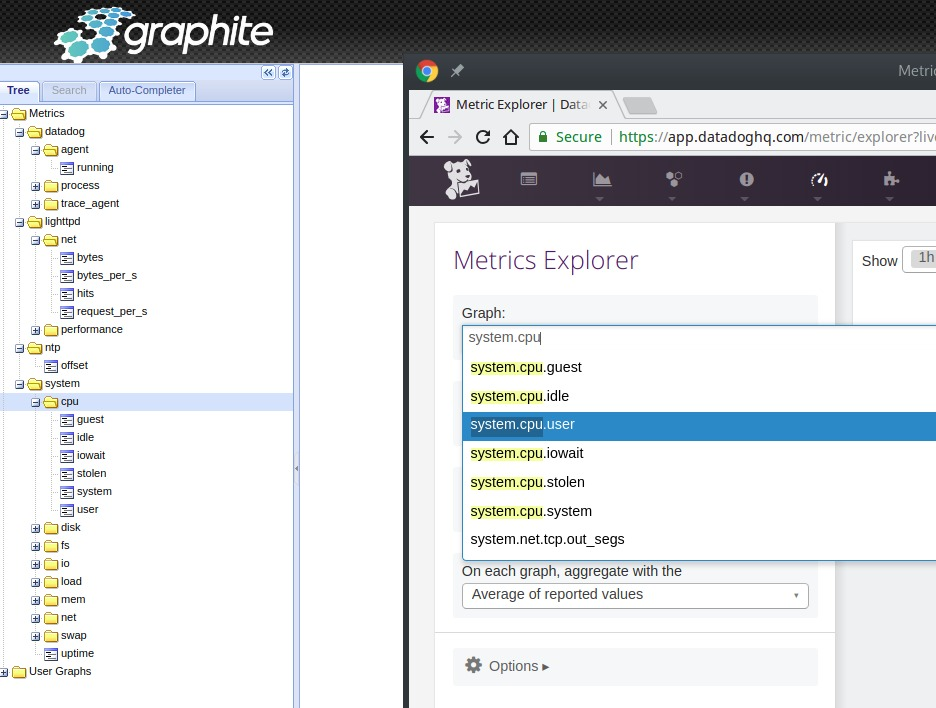

# graphite-datadog

Read :dog: Datadog metrics in :chart_with_upwards_trend: Graphite

:warning: work in progress :warning:



## Installation

```bash
pip install graphite-datadog
```


```python
STORAGE_FINDERS = (
    'graphite_datadog.DataDogFinder',
)
TAGDB = 'graphite_datadog.DataDogTagDB'
DATADOG_API_KEY = 'API_KEY'
DATADOG_APP_KEY = 'APP_KEY'
```

## Dev

Create a virtualenv

```python
export GRAPHITE_NO_PREFIX=true
virtualenv venv -p python3
pip install -e .
```

Edit venv/lib/python*/site-packages/graphite/local_setings.py

```python
import os

DEBUG = True
LOG_DIR = '/tmp'
STORAGE_DIR = '/tmp'
WEBAPP_DIR = "%s/webapp/" % os.environ['VIRTUAL_ENV']

STORAGE_FINDERS = (
    'graphite_datadog.DataDogFinder',
)
TAGDB = 'graphite_datadog.DataDogTagDB'
DATADOG_API_KEY = 'API_KEY'
DATADOG_APP_KEY = 'APP_KEY'
```

Start graphite-web

```bash
export DJANGO_SETTINGS_MODULE=graphite.settings
django-admin migrate
django-admin migrate --run-syncdb
run-graphite-devel-server.py ${BG_VENV}
```

See:
* https://docs.datadoghq.com/api/?lang=python#metrics

